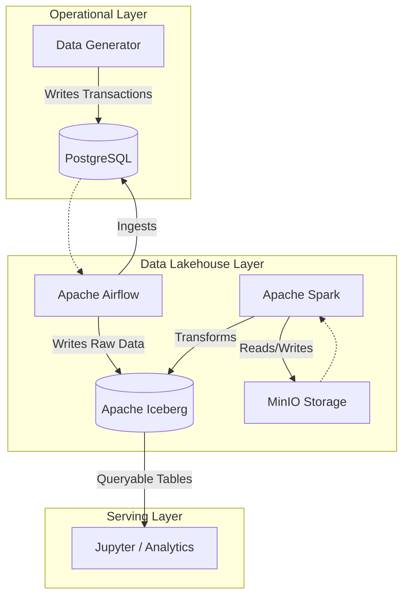

# End-to-End E-commerce Data Platform

A comprehensive Data Engineering platform simulating a real-world e-commerce ecosystem. This project integrates **Operational Databases**, **Data Generation**, **Data Lakehouse**, and **Orchestration** pipelines to demonstrate a full-stack data solution.

## 🏗 Architecture

The platform follows a standard **Lakehouse** architecture:



## 🚀 Key Features

*   **Omni-channel E-commerce Simulation**: Sophisticated business logic covering the entire retail ecosystem:
    *   **Multi-channel Ecosystem**: Integrated flows for Shopee, Lazada, Tiki, and internal Website.
    *   **Customer Loyalty System**: Dynamic tiering (Bronze to Platinum) based on spending and loyalty points.
    *   **Advanced Order Management**: Complete lifecycle tracking from Pending to Delivered/Returned.
    *   **Inventory & Logistics**: Multi-warehouse support with FIFO logs and safety stock alerts.
    *   **Activity Intelligence**: Behavioral tracking (views, searches, cart actions) for RAG/MLOps integration.
*   **Dynamic Data Generation**: Simulates realistic e-commerce scenarios including:
    *   **Normal Day**: Regular traffic and transaction patterns.
    *   **Flash Sale**: High-concurrency spikes in orders.
    *   **Fraud Attack**: Anomalous transaction patterns for detection testing.
    *   **Promotion Blast**: Marketing campaign effects.
*   **Modern Data Stack**:
    *   **Apache Iceberg**: For ACID transactions and scalable table formats on the Data Lake.
    *   **Apache Airflow**: For orchestrating complex ingestion and transformation workflows.
    *   **Apache Spark**: Distributed processing for heavy data transformations.
    *   **MinIO**: S3-compatible object storage for the Data Lake.
*   **Containerized Environment**: Fully containerized using Docker and Docker Compose for easy deployment.

## 📊 Business Intelligence & KPIs

Designed to support data-driven decision making, the platform facilitates tracking of:
*   **Financial Metrics**: GMV (Gross Merchandise Value), AOV (Average Order Value), and detailed Profit Margin analysis.
*   **Operational Excellence**: Shipping SLA compliance, Inventory Turnover rates, and Return Rate monitoring.
*   **Customer Insights**: Retention rates, Cart Abandonment analysis, and Cart-to-Order conversion funnels.

## 🗄️ Enhanced Data Schema

The database schema (`01_schema.sql`) has been expanded to 20+ tables to support deep relational analysis:
*   **Core Entities**: `orders`, `order_items`, `customers`, `products`, `inventory`.
*   **Audit & Tracking**: `inventory_log`, `order_status_history`, `customer_activity_log`.
*   **Experience & Retention**: `cart`, `cart_items`, `wishlist`, `order_return`.
*   **Data Integrity**: Strict FK constraints and PL/pgSQL validation rules to ensure high-quality data for the Lakehouse.

## 🛠 Technology Stack

| Component | Technology | Description |
| :--- | :--- | :--- |
| **Orchestration** | Apache Airflow 2.x | Workflow management (CeleryExecutor) |
| **Processing** | Apache Spark 3.x | Distributed data processing (Master/Worker) |
| **Storage** | MinIO | S3-compatible object storage |
| **Table Format** | Apache Iceberg | High-performance table format for huge analytic datasets |
| **Database** | PostgreSQL 16 | Operational transactional database |
| **Caching/Msg** | Redis | Message broker for Airflow Celery |
| **Language** | Python, SQL | Core implementation languages |
| **Infrastructure** | Docker Compose | Multi-container orchestration |

## 📂 Project Structure

```text
.
├── airflow/                # Airflow configuration and DAGs
│   ├── dags/               # Workflow definitions (Ingestion, Transformation)
│   ├── config/             # Airflow config files
│   └── Dockerfile          # Custom Airflow image definition
├── gen_data/               # Data generation module
│   ├── generators/         # Entity generators (User, Product, etc.)
│   ├── scenarios/          # Simulation scenarios (Normal, Flash Sale)
│   └── core/               # Core transaction logic
├── spark/                  # Spark configuration and Notebooks
│   └── notebook/           # Jupyter notebooks for ad-hoc analysis
├── iceberg/                # Iceberg catalog configuration
├── minio/                  # MinIO storage configuration
└── docker-compose.yaml     # Main entry point for services
```

## 🏁 Getting Started

### Prerequisites

*   **OS**: Linux / macOS (Windows users should use WSL2)
*   **Docker**: v20.10+
*   **Docker Compose**: v2.0+
*   **Hardware**: Minimum 8GB RAM (16GB Recommended) and 4 CPUs.

### Installation

1.  **Clone the repository**:
    ```bash
    git clone <repo-url>
    cd <repo-name>
    ```

2.  **Environment Setup**:
    Ensure the `.env` file exists (or copy from example if provided). By default, the `docker-compose.yaml` handles most configurations.

3.  **Start the Platform**:
    Run the following command to pull images and start all services:
    ```bash
    docker compose up -d
    ```

4.  **Verify Status**:
    Check if all containers are healthy:
    ```bash
    docker compose ps
    ```

## 🖥 Usage Guide

### 1. Data Generation
The `gen_data` service runs automatically on startup. It connects to the PostgreSQL database and begins simulating transactions based on the configured scenario (default: `NormalDay`).

### 2. Airflow Orchestration
Access the Airflow UI to manage pipelines.
*   **Login**: `airflow` / `airflow`
*   **DAGs**:
    *   `01_ingestion`: Jobs that pull data from Postgres to MinIO (Iceberg Raw).
    *   `02_transformation`: Spark jobs that process Raw data into Silver/Gold layers.

### 3. Spark Processing
Monitor Spark jobs and cluster status via the Spark Master UI. Notebooks are available for interactive data exploration.

### 4. Data Lake Access
Browse raw files and Iceberg metadata using the MinIO Console.

## 🔌 Access Points

| Service | Port | URL | Credentials (Default) |
| :--- | :--- | :--- | :--- |
| **Airflow Webserver** | `8081` | [http://localhost:8081](http://localhost:8081) | `airflow`/`airflow` |
| **Spark Master UI** | `8080` | [http://localhost:8080](http://localhost:8080) | N/A |
| **Spark Worker UI** | `8082` | [http://localhost:8082](http://localhost:8082) | N/A |
| **Jupyter Lab** | `8888` | [http://localhost:8888](http://localhost:8888) | Token (check logs) |
| **MinIO Console** | `9001`* | [http://localhost:9001](http://localhost:9001) | `admin`/`admin123` |
| **MinIO API** | `9000` | `http://localhost:9000` | `admin`/`admin123` |
| **PostgreSQL** | `5435` | `localhost:5435` | `airflow`/`airflow` (for airflow db) |

*> Note: MinIO Console port might vary depending on dynamic assignment, check `docker compose ps` if 9001 doesn't work.*

## 🤝 Contributing

Contributions are welcome! Please fork the repository and submit a Pull Request.

## 📄 License

This project is licensed under the Apache 2.0 License.
