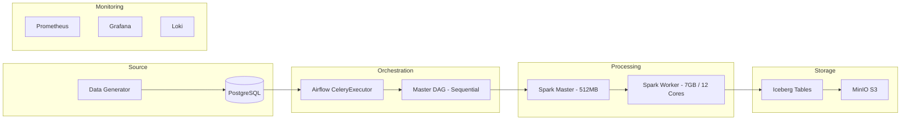
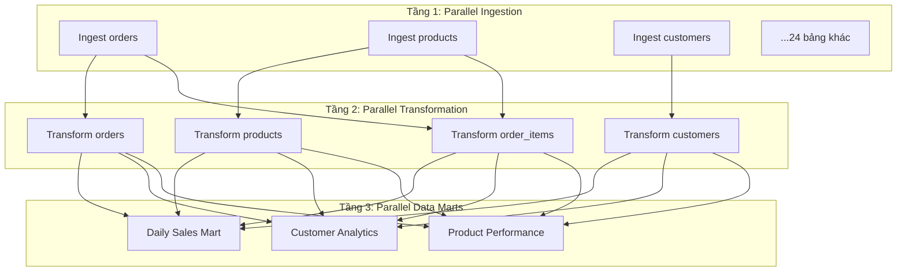
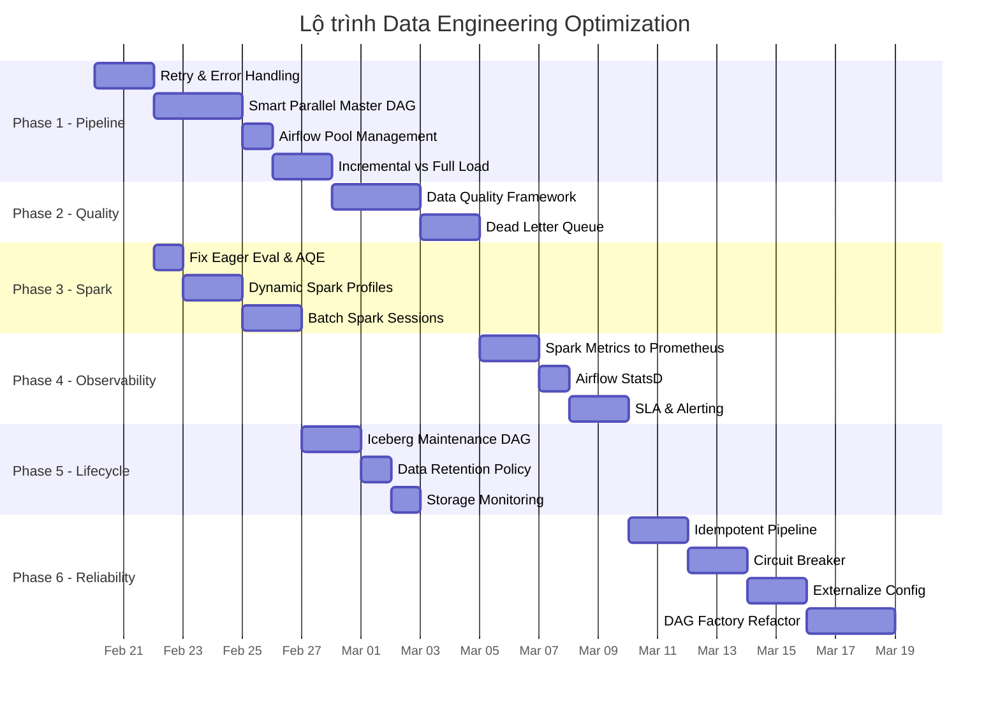

# 🛠️ Data Engineering Optimization Roadmap

> **Kế hoạch tối ưu hóa luồng dữ liệu & hệ thống vận hành**
> Ngày tạo: 2026-02-17 | Phiên bản: 1.0

---

## 📋 Mục lục

1. [Tổng quan hiện trạng](#1-tổng-quan-hiện-trạng)
2. [Phase 1: Tối ưu Pipeline Orchestration](#phase-1-tối-ưu-pipeline-orchestration)
3. [Phase 2: Data Quality & Validation](#phase-2-data-quality--validation)
4. [Phase 3: Spark Performance Tuning](#phase-3-spark-performance-tuning)
5. [Phase 4: Operational Observability](#phase-4-operational-observability)
6. [Phase 5: Data Lifecycle Management](#phase-5-data-lifecycle-management)
7. [Phase 6: Reliability & Fault Tolerance](#phase-6-reliability--fault-tolerance)
8. [Lộ trình triển khai](#lộ-trình-triển-khai)

---

## 1. Tổng quan hiện trạng

### Kiến trúc hiện tại



### Thống kê hệ thống

| Thành phần | Số lượng | Ghi chú |
|:---|:---|:---|
| Bảng nguồn (PostgreSQL) | 25 | Schema v2.0 |
| DAG Ingestion | 25 | Mỗi bảng 1 DAG riêng |
| DAG Transformation | 25 | Raw → Silver |
| DAG Data Marts | 9 | Silver → Gold |
| Master DAG | 1 | Chạy tuần tự toàn bộ |
| Spark Worker | 1 | 12 cores / 7GB RAM |
| Airflow Parallelism | 8 | CeleryExecutor, 1 Worker |

### Các vấn đề đã phát hiện

| # | Vấn đề | Mức độ | Ảnh hưởng |
|:--|:---|:---|:---|
| 1 | Master DAG chạy tuần tự 59 DAGs | 🔴 Critical | Thời gian pipeline dài, lãng phí tài nguyên |
| 2 | Không có Data Quality checks | 🔴 Critical | Dữ liệu lỗi lan truyền tới Gold layer |
| 3 | Maintenance DAG rỗng (chưa implement) | 🟡 High | Iceberg table không được compact, metadata phình to |
| 4 | `shuffle.partitions = 1` hard-coded | 🟡 High | Bottleneck khi data lớn, không tận dụng parallelism |
| 5 | Không có Spark metrics trong Prometheus | 🟡 High | Không quan sát được performance Spark jobs |
| 6 | Credentials hard-coded trong code | 🟡 High | Rủi ro bảo mật, khó quản lý môi trường |
| 7 | `retries = 0` trên tất cả DAGs | 🟡 High | Pipeline fail ngay lần đầu, không tự recovery |
| 8 | Không có SLA/timeout monitoring | 🟠 Medium | Không phát hiện pipeline chậm bất thường |
| 9 | `df.count()` trong ingestion (eager eval) | 🟠 Medium | Trigger full scan không cần thiết |
| 10 | Không có dead letter queue cho data lỗi | 🟠 Medium | Mất dữ liệu khi gặp record lỗi format |

---

## Phase 1: Tối ưu Pipeline Orchestration

> **Mục tiêu**: Giảm thời gian chạy pipeline tổng thể, tăng throughput.

### 1.1 Tái cấu trúc Master DAG — Smart Parallel Orchestration

**Hiện tại**: Master DAG chạy 59 tasks **hoàn toàn tuần tự** (ingest → transform → mart, lần lượt từng bảng).

**Đề xuất**: Chia pipeline thành 3 tầng song song hóa thông minh:


**Chi tiết thay đổi**:

- **Tầng 1 — Ingestion**: Chạy song song tất cả 25 DAGs ingestion (pool giới hạn = 4 concurrent jobs)
- **Tầng 2 — Transformation**: Chạy song song nhưng tôn trọng dependency giữa các bảng:
  - `transform_order_items` chỉ chạy SAU `ingest_orders` + `ingest_order_items` + `ingest_product`
  - `transform_shipment` SAU `ingest_orders` + `ingest_shipment`
  - Các bảng dimension (brand, category, ...) chạy song song không phụ thuộc
- **Tầng 3 — Data Marts**: Chạy song song tất cả mart sau khi Silver layer hoàn tất

**Ước tính cải thiện**: Pipeline từ ~3-4 giờ → ~45-60 phút (ước lượng).

### 1.2 Airflow Pool & Slot Management

**Hiện tại**: Không quản lý resource pool, tất cả task dùng chung `default_pool`.

**Đề xuất**:

```
Pool: spark_ingestion    → 4 slots   (4 Spark jobs chạy song song cho ingestion)
Pool: spark_transform    → 2 slots   (2 Spark jobs cho transform, cần nhiều memory hơn)
Pool: spark_mart         → 2 slots   (2 Spark jobs cho data mart)
Pool: postgres_read      → 6 slots   (giới hạn concurrent reads vào PostgreSQL)
```

### 1.3 Dynamic DAG Generation

**Hiện tại**: 25 file ingestion DAG + 25 file transformation DAG — mỗi file ~ 30-60 dòng code gần giống nhau.

**Đề xuất**: Sử dụng **DAG Factory pattern** — 1 file config YAML + 1 file generator tạo tất cả DAGs.

```yaml
# config/tables.yaml
tables:
  orders:
    ingestion:
      query: "SELECT * FROM orders WHERE DATE(created_at) = '{{ ds }}'"
      partition_by: created_at
    transformation:
      transformer_class: OrdersTransformer
      depends_on: [orders]
  product:
    ingestion:
      query: "SELECT * FROM product"
      partition_by: created_at
      is_full_load: true  # Dimension table → full load
    transformation:
      transformer_class: DefaultTransformer
```

**Lợi ích**:
- Giảm 50 files → 3 files (config + ingestion_factory + transformation_factory)
- Thêm bảng mới chỉ cần khai báo YAML
- Dễ dàng thay đổi behavior (ingestion mode, partition strategy) qua config

### 1.4 Incremental vs Full Load Strategy

**Hiện tại**: Tất cả bảng dùng logic lọc `WHERE DATE(created_at) = '{{ ds }}'` — không phù hợp cho dimension tables.

**Đề xuất**: Phân loại rõ ràng:

| Loại | Bảng | Chiến lược |
|:---|:---|:---|
| **Fact (Incremental)** | `orders`, `order_items`, `payment`, `shipment`, `order_return`, `cart`, `cart_items`, `customer_activity_log`, `inventory_log`, `order_status_history`, `wishlist`, `product_review` | CDC / Incremental by timestamp |
| **Dimension (Full/SCD)** | `product`, `customers`, `category`, `brand`, `sub_category`, `discount`, `geo_location`, `warehouse`, `logistics_partner`, `order_channel`, `shipping_method`, `inventory` | Full Reload hoặc SCD Type 2 |

---

## Phase 2: Data Quality & Validation

> **Mục tiêu**: Bảo vệ Data Lake khỏi dữ liệu lỗi, tăng độ tin cậy cho Business Intelligence.

### 2.1 Data Quality Framework

**Công cụ đề xuất**: Xây dựng module quality check tích hợp vào pipeline (trước khi ghi vào Silver/Gold).

**Các rule kiểm tra theo từng layer**:

#### Raw → Silver (Pre-Transform Validation)

| Rule | Bảng áp dụng | Mô tả |
|:---|:---|:---|
| **Not Null** | `orders.id`, `customers.id` | Primary keys không được null |
| **Uniqueness** | Tất cả primary keys | Không duplicate trong cùng batch |
| **Freshness** | `orders.created_at` | Dữ liệu không quá 48h so với `ds` |
| **Row Count** | Tất cả | So sánh với source, chênh lệch < 5% |
| **Schema Match** | Tất cả | Columns phải khớp với expected schema |

#### Silver → Gold (Pre-Mart Validation)

| Rule | Bảng áp dụng | Mô tả |
|:---|:---|:---|
| **Referential Integrity** | `order_items → orders` | Mọi `order_id` phải tồn tại trong `orders` |
| **Business Logic** | `orders.total_price` | Phải ≥ 0, phải = SUM(order_items.amount) |
| **Completeness** | `payment` | Mọi delivered order phải có payment record |
| **Range Check** | `discount.discount_rate` | Phải trong khoảng 0-100% |

### 2.2 Dead Letter Queue (DLQ)

**Mục đích**: Dữ liệu không pass validation sẽ được lưu riêng thay vì bị drop.

```
iceberg.quarantine.<table_name>     ← Chứa records lỗi kèm metadata (lý do reject, timestamp)
```

**Flow**:
```
Source → Validate → ✅ Pass → Silver
                  → ❌ Fail → Quarantine table + Alert
```

### 2.3 Data Quality Dashboard (Grafana)

- **Metrics**: Pass/fail rate theo table, rule type, theo ngày
- **Alerting**: Notification khi fail rate > 5% hoặc row count drop > 20%

---

## Phase 3: Spark Performance Tuning

> **Mục tiêu**: Tối ưu tài nguyên Spark, giảm thời gian xử lý & tránh OOM.

### 3.1 Dynamic Resource Allocation

**Hiện tại**: Tất cả jobs dùng cùng config cố định (`2 cores, 1g executor, 512m driver`) và chỉ có 1 worker

**Đề xuất**: Sử dụng K8S để scale worker pool

### 3.2 Fix Eager Evaluation Anti-Pattern

**Hiện tại** (trong `ingest_table_to_iceberg.py`):
```python
# ❌ Gọi df.count() trigger FULL SCAN để chỉ check empty
if self.df is not None and self.df.count() > 0:
```

**Đề xuất**:
```python
# ✅ Dùng limit(1) + take(1) — dừng ngay khi tìm thấy 1 row
if self.df is not None and len(self.df.limit(1).take(1)) > 0:
```

### 3.3 Adaptive Query Execution (AQE) Tuning

**Hiện tại**: AQE enabled nhưng `shuffle.partitions = 1` override cứng → AQE không hoạt động đúng.

**Đề xuất**: Bỏ hard-code, để AQE tự điều chỉnh:

```python
"spark.sql.adaptive.enabled": "true",
"spark.sql.adaptive.coalescePartitions.enabled": "true",
"spark.sql.adaptive.coalescePartitions.initialPartitionNum": "8",
"spark.sql.adaptive.advisoryPartitionSizeInBytes": "128mb",
# Bỏ dòng: 'spark.sql.shuffle.partitions': '1'
```

### 3.4 Spark Session Reuse

**Hiện tại**: Mỗi SparkSubmitOperator tạo 1 Spark Application mới → chi phí khởi tạo JVM cao.

**Đề xuất khả thi**: Batch nhiều bảng nhỏ vào 1 Spark Application duy nhất.

```
# Thay vì 25 Spark apps cho ingestion:
App 1: Ingest [brand, category, sub_category, warehouse, logistics_partner, shipping_method, order_channel]  ← 7 dimension tables
App 2: Ingest [orders, order_items, payment]  ← 3 fact tables liên quan
App 3: Ingest [customers, geo_location, customer_activity_log]
...
```

**Lợi ích**: Giảm từ 25 lần → ~5-6 lần khởi tạo JVM (tiết kiệm ~5-10 phút/pipeline run).

### 3.5 Caching Strategy cho Data Marts

**Hiện tại**: Mỗi Data Mart đọc lại Silver tables từ MinIO (I/O scan lặp lại).

**Đề xuất**: Cache các Silver fact tables được dùng bởi nhiều marts:

```python
# orders_silver được dùng bởi: daily_sales, customer_analytics, logistics, cart_analytics
orders_silver = spark.table("iceberg.silver.orders").cache()
```

---

## Phase 4: Operational Observability

> **Mục tiêu**: Giám sát toàn diện pipeline health, phát hiện sớm vấn đề trước khi ảnh hưởng business.

### 4.1 Spark Metrics → Prometheus

**Hiện tại**: Prometheus không scrape bất kỳ Spark metric nào.

**Đề xuất**: Expose Spark metrics qua Prometheus servlet:

```properties
# spark/metrics.properties
*.sink.prometheusServlet.class=org.apache.spark.metrics.sink.PrometheusServlet
*.sink.prometheusServlet.path=/metrics/prometheus
master.sink.prometheusServlet.path=/metrics/master/prometheus
applications.sink.prometheusServlet.path=/metrics/applications/prometheus
```

**Metrics quan trọng cần monitor**:
- `spark_executor_memory_used` — Phát hiện memory pressure
- `spark_job_duration_seconds` — Track processing time
- `spark_shuffle_bytes_written` — Phát hiện data skew
- `spark_task_failures_total` — Task retry rate

### 4.2 Airflow StatsD Integration

**Hiện tại**: Config Prometheus có `airflow-statsd` job nhưng chưa enable StatsD trong Airflow.

**Đề xuất**: Bật StatsD exporter:

```yaml
# docker-compose.airflow.yaml
AIRFLOW__METRICS__STATSD_ON: 'true'
AIRFLOW__METRICS__STATSD_HOST: 'statsd-exporter'
AIRFLOW__METRICS__STATSD_PORT: '9125'
```

**Metrics quan trọng**:
- `airflow_dag_processing_total_parse_time` — DAG parse time
- `airflow_dagrun_duration_success` — Pipeline completion time
- `airflow_task_instance_failures` — Task failure rate
- `airflow_pool_running_slots` — Pool utilization

### 4.3 Pipeline SLA & Alerting

**Đề xuất**: Thiết lập SLA cho từng tầng pipeline:

| Pipeline Stage | SLA Target | Alert Threshold |
|:---|:---|:---|
| Full Ingestion (tất cả 25 bảng) | 30 phút | > 45 phút |
| Full Transformation | 30 phút | > 45 phút |
| Data Marts | 20 phút | > 30 phút |
| End-to-End Pipeline | 90 phút | > 120 phút |
| Single table ingestion | 5 phút | > 10 phút |

**Implementation**: Sử dụng Airflow SLA feature + custom Prometheus alerts.

### 4.4 Data Lineage Dashboard

**Mục đích**: Trả lời câu hỏi "dữ liệu trong mart X đến từ đâu và được transform như thế nào?"

**Đề xuất**: Xây dựng metadata tracking:

```
Mỗi record trong Silver/Gold sẽ mang metadata:
- _source_table     (đã có ✅)
- _pipeline_run_id  (mới: liên kết với Airflow DAG Run)
- _processed_at     (đã có ✅)
- _data_version     (mới: Iceberg snapshot ID)
```

---

## Phase 5: Data Lifecycle Management

> **Mục tiêu**: Quản lý vòng đời dữ liệu trong Data Lake — tránh phình storage và metadata.

### 5.1 Iceberg Table Maintenance — Implement Compact & Cleanup

**Hiện tại**: File `maintenance/optimize_iceberg_tables.py` **rỗng** — chưa implement.

**Đề xuất**: Implement DAG maintenance chạy hàng ngày:

```sql
-- 1. Compact Small Files (Critical cho hiệu năng đọc)
CALL iceberg.system.rewrite_data_files(
    table => 'iceberg.silver.orders',
    options => map('target-file-size-bytes', '134217728')  -- 128MB
);

-- 2. Expire Old Snapshots (Giải phóng storage)
CALL iceberg.system.expire_snapshots(
    table => 'iceberg.silver.orders',
    older_than => TIMESTAMP '{{ macros.ds_add(ds, -7) }} 00:00:00',
    retain_last => 5
);

-- 3. Remove Orphan Files
CALL iceberg.system.remove_orphan_files(
    table => 'iceberg.silver.orders',
    older_than => TIMESTAMP '{{ macros.ds_add(ds, -3) }} 00:00:00'
);

-- 4. Rewrite Manifests (Tối ưu metadata)
CALL iceberg.system.rewrite_manifests('iceberg.silver.orders');
```

**Schedule**: Chạy hàng ngày sau khi pipeline chính hoàn tất (off-peak hours).

### 5.2 Data Retention Policy

| Layer | Retention | Chiến lược |
|:---|:---|:---|
| **Raw** | 30 ngày | Expire snapshots > 30 ngày |
| **Silver** | 90 ngày | Giữ 90 ngày data, expire old snapshots weekly |
| **Gold** | 365 ngày | Giữ lâu hơn phục vụ BI reporting |
| **Quarantine** | 14 ngày | Auto-cleanup sau khi review |

### 5.3 Storage Monitoring

**Metrics cần track**:
- Tổng dung lượng MinIO theo bucket/prefix (raw, silver, gold)
- Số lượng small files per table (< 10MB)
- Tỉ lệ tăng trưởng storage hàng ngày/tuần
- Metadata file count per table

---

## Phase 6: Reliability & Fault Tolerance

> **Mục tiêu**: Pipeline tự recovery khi gặp lỗi, giảm thiểu manual intervention.

### 6.1 Retry & Error Handling Policy

**Hiện tại**: `retries = 0` trên tất cả DAGs — fail 1 lần là pipeline dừng.

**Đề xuất**:

```python
default_args = {
    'owner': 'ngoctam',
    'retries': 3,
    'retry_delay': timedelta(minutes=2),
    'retry_exponential_backoff': True,
    'max_retry_delay': timedelta(minutes=15),
    'execution_timeout': timedelta(minutes=30),
    'on_failure_callback': alert_on_failure,  # Gửi notification
}
```

### 6.2 Idempotent Pipeline Design

**Hiện tại**: Ingestion dùng `.append()` → chạy lại sẽ **duplicate** data.

**Đề xuất**: Chuyển sang **Overwrite by Partition** cho idempotency:

```python
# Thay vì: self.df.writeTo(self.target_table).append()
# Dùng:
self.df.writeTo(self.target_table) \
    .overwritePartitions()
# Hoặc dùng dynamic overwrite:
spark.conf.set("spark.sql.sources.partitionOverwriteMode", "dynamic")
```

**Lợi ích**: Chạy lại cùng `ds` sẽ replace data cùng ngày, không duplicate.

### 6.3 Circuit Breaker Pattern

**Mục đích**: Ngăn cascading failure khi 1 service gặp sự cố.

```python
# Nếu PostgreSQL không phản hồi → dừng tất cả ingestion tasks
# Nếu MinIO unreachable → dừng write operations
# Nếu > 3 ingestion tasks fail → dừng pipeline, gửi alert P1
```

### 6.4 Checkpoint & Resumable Pipeline

**Đề xuất**: Cho phép pipeline resume từ điểm fail thay vì chạy lại từ đầu.

```
# Airflow TriggerRule.ALL_DONE (đã có ✅)
# + Bổ sung: Track processed tables trong XCom hoặc metadata DB
# → Khi retry, chỉ chạy các tables chưa hoàn thành
```

### 6.5 Externalize Configuration

**Hiện tại**: Credentials hard-coded trong code Python (JDBC URL, MinIO keys, ...).

**Đề xuất**: Chuyển toàn bộ sang Airflow Variables / Connections / Vault:

| Config | Hiện tại | Đề xuất |
|:---|:---|:---|
| JDBC URL | Hard-coded trong script | Airflow Connection `postgres_default` |
| MinIO credentials | Hard-coded | Airflow Connection `minio_default` (đã có) |
| Spark resource config | Hard-coded | Config file / Airflow Variable |
| Iceberg catalog | Hard-coded | Environment variable |

---

## Lộ trình triển khai



### Ưu tiên triển khai (Quick Wins trước)

| Ưu tiên | Task | Effort | Impact |
|:---|:---|:---|:---|
| 🥇 1 | Retry & Error Handling (6.1) | 🟢 Thấp | 🔴 Cao |
| 🥇 2 | Fix Eager Eval (3.2) + AQE (3.3) | 🟢 Thấp | 🟡 TB-Cao |
| 🥇 3 | Idempotent Pipeline (6.2) | 🟢 Thấp | 🔴 Cao |
| 🥈 4 | Smart Parallel Master DAG (1.1) | 🟡 TB | 🔴 Cao |
| 🥈 5 | Iceberg Maintenance DAG (5.1) | 🟡 TB | 🟡 TB-Cao |
| 🥈 6 | Data Quality Framework (2.1) | 🟡 TB | 🔴 Cao |
| 🥈 7 | Spark Metrics → Prometheus (4.1) | 🟡 TB | 🟡 TB |
| 🥉 8 | Dynamic Spark Profiles (3.1) | 🟡 TB | 🟡 TB |
| 🥉 9 | Airflow Pools (1.2) | 🟢 Thấp | 🟡 TB |
| 🥉 10 | DAG Factory Pattern (1.3) | 🔴 Cao | 🟡 TB |

---

## Ghi chú kỹ thuật

### Nguyên tắc thiết kế

1. **Idempotency First**: Mọi pipeline phải chạy lại được mà không tạo duplicate data.
2. **Fail Fast, Recover Smart**: Detect lỗi sớm, retry tự động, alert khi cần người can thiệp.
3. **Observable by Default**: Mọi component phải expose metrics và logs có cấu trúc.
4. **Config over Code**: Tách behavior ra khỏi code, quản lý qua config files.
5. **Data Quality as a Gate**: Dữ liệu phải pass quality check trước khi vào layer tiếp theo.

### Rủi ro & Mitigation

| Rủi ro | Mitigation |
|:---|:---|
| Song song hóa quá nhiều → Spark OOM | Airflow Pools giới hạn concurrent jobs |
| Compact Iceberg → downtime đọc | Chạy maintenance off-peak, Iceberg hỗ trợ concurrent R/W |
| Data quality check chậm pipeline | Async quality check + fail nhanh với sampling |
| DAG Factory refactor → regression | Giữ DAG IDs giống cũ, test kỹ trước migration |

---

> 📌 **Tài liệu liên quan**:
> - [Data Dictionary](data_dictionary.md)
> - [Business Analysis](ecommerce_business_analysis.md)
> - [DevOps Infrastructure](../DEVOPS_README.md)
> - [Airflow DAGs Documentation](../airflow/README.md)
