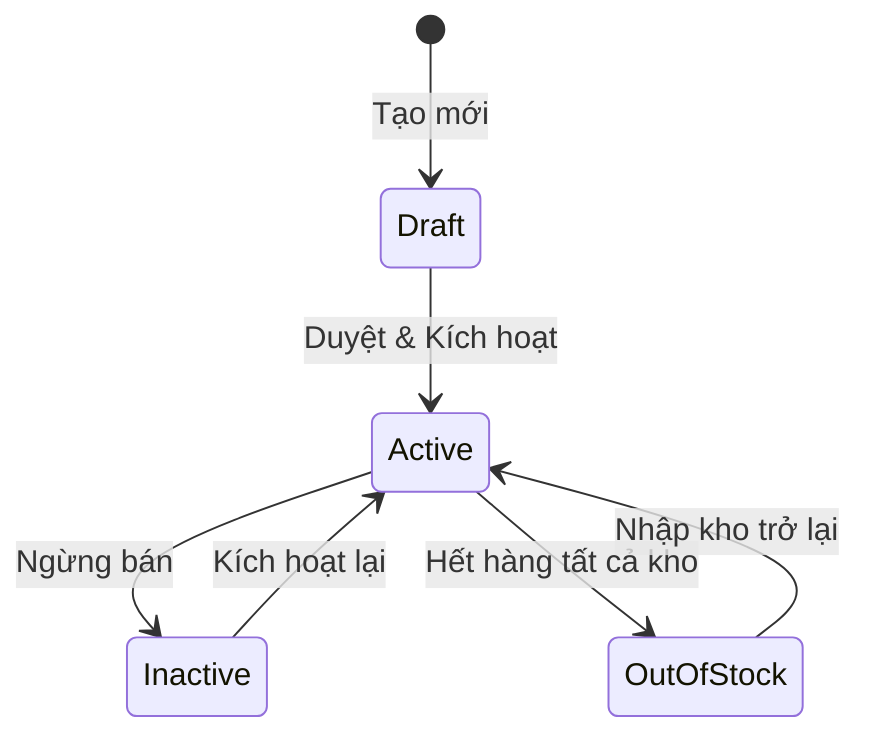
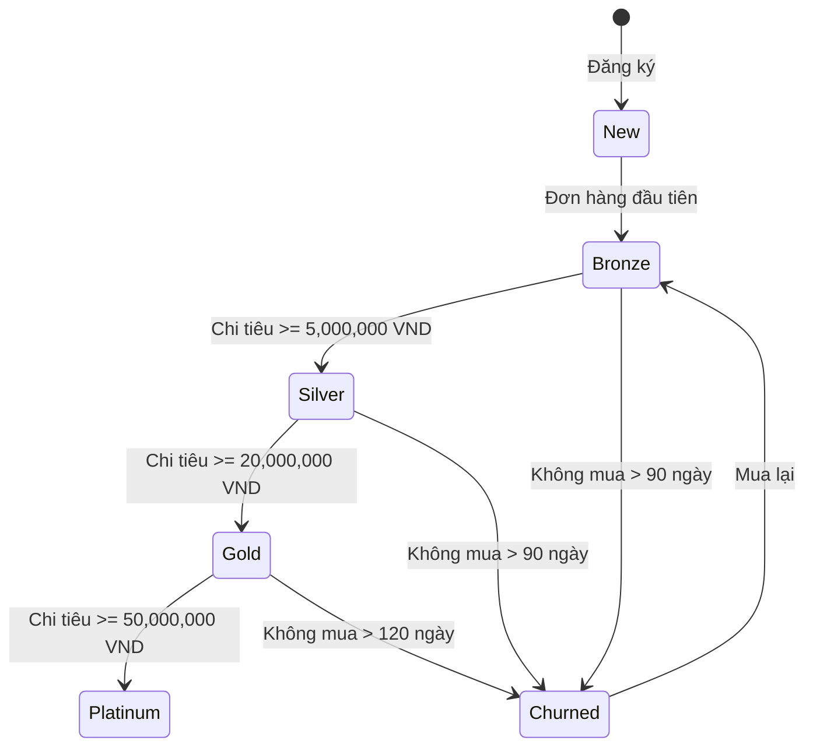
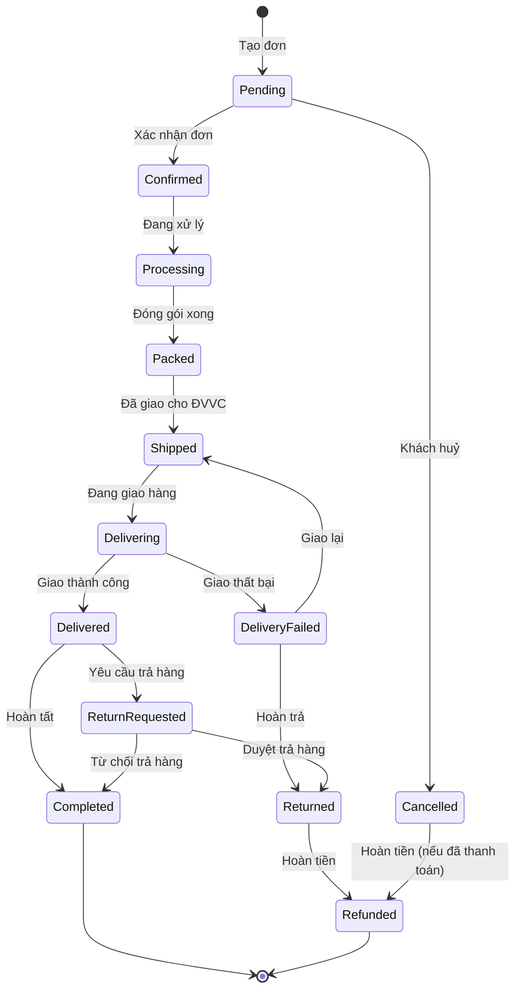
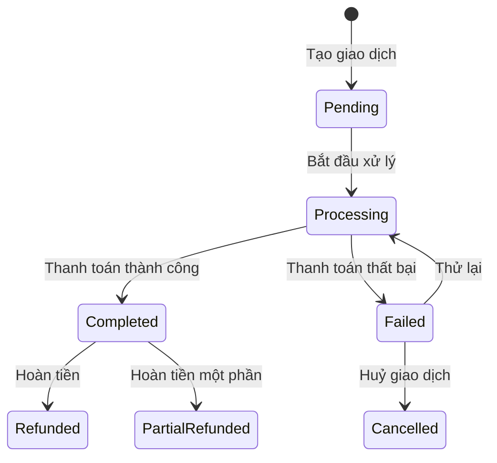
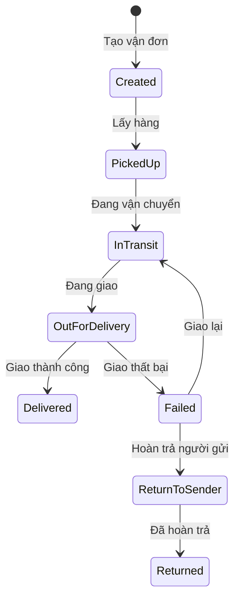
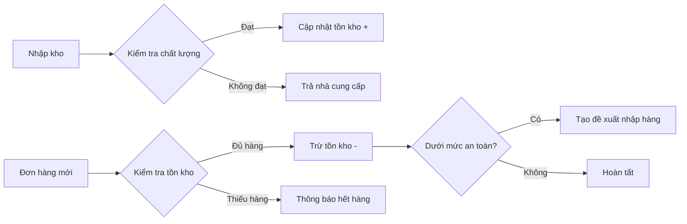
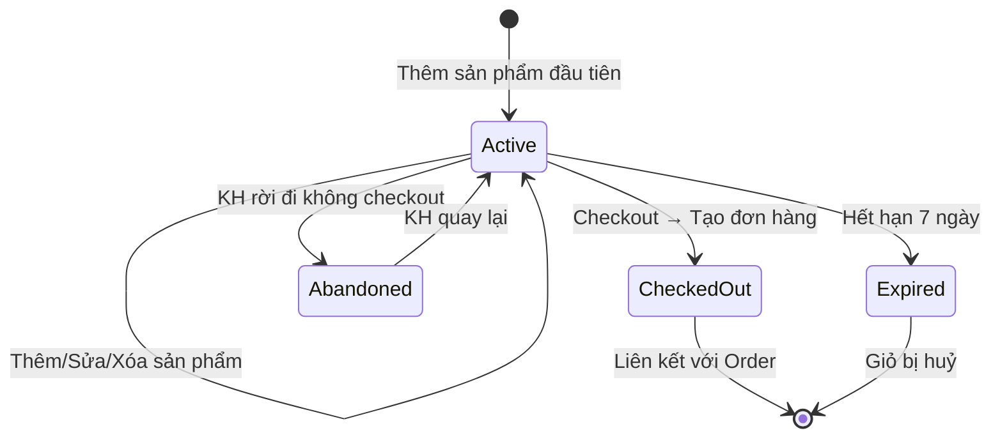
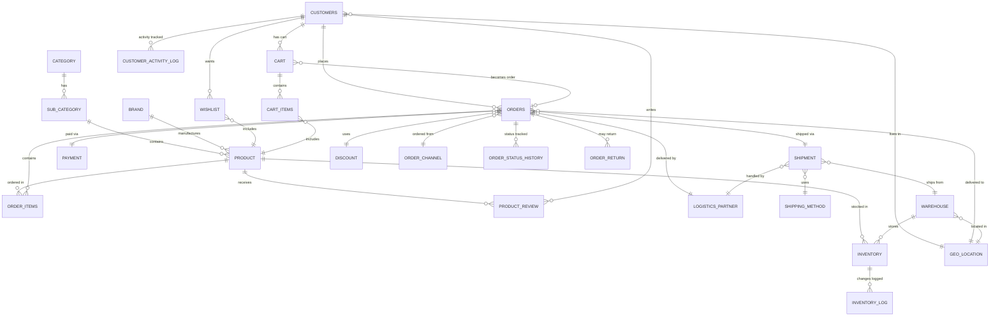

# Phân Tích Nghiệp Vụ Thương Mại Điện Tử (E-commerce Business Analysis)

> **Phiên bản**: 2.1  
> **Ngày cập nhật**: 2026-02-15  
> **Phạm vi**: Nền tảng bán lẻ điện tử đa kênh (Shopee, Lazada, Tiki, Website)

---

## 1. Tổng Quan Hệ Thống

### 1.1 Mô Hình Kinh Doanh
Công ty vận hành mô hình **bán lẻ đa kênh (Omni-channel)** trong lĩnh vực thiết bị công nghệ tại Việt Nam:
- **Sản phẩm**: Điện thoại, Laptop, Phụ kiện công nghệ, Thiết bị thông minh
- **Kênh bán hàng**: Shopee, Lazada, Tiki, Website nội bộ
- **Vận chuyển**: AhaMove, GHN Express, Viettel Post, GHTK, J&T Express, ...
- **Thanh toán**: MoMo, ZaloPay, VNPay, Thẻ tín dụng, COD, Chuyển khoản ngân hàng

### 1.2 Các Bên Liên Quan (Stakeholders)

| Vai trò | Mô tả |
|---|---|
| **Khách hàng** | Người mua hàng trên các kênh bán |
| **Quản lý kho** | Quản lý tồn kho, nhập/xuất hàng |
| **Bộ phận bán hàng** | Xử lý đơn hàng, tư vấn khách hàng |
| **Bộ phận vận chuyển** | Đóng gói, giao hàng, theo dõi vận đơn |
| **Bộ phận tài chính** | Quản lý thanh toán, hoàn tiền, đối soát |
| **Bộ phận marketing** | Quản lý khuyến mãi, chương trình giảm giá |
| **Ban giám đốc** | Xem báo cáo, ra quyết định chiến lược |

---

## 2. Các Nghiệp Vụ Chính (Business Domains)

### 2.1 Quản Lý Sản Phẩm (Product Management)

#### Phân cấp sản phẩm
```
Category (Danh mục lớn)
  └── Sub-Category (Danh mục con)
       └── Product (Sản phẩm)
            └── Brand (Thương hiệu)
```

#### Quy tắc nghiệp vụ
- Mỗi sản phẩm thuộc **1 danh mục con** và **1 thương hiệu**
- Sản phẩm có mã SKU duy nhất (`product_sku`)
- Giá sản phẩm (`price`) là giá niêm yết gốc
- Sản phẩm có trạng thái `is_active` — chỉ sản phẩm active mới được bán
- Sản phẩm có thể nhận **đánh giá** (review) từ khách hàng (1-5 sao)

#### Flow: Vòng đời sản phẩm


---

### 2.2 Quản Lý Khách Hàng (Customer Management)

#### Thông tin khách hàng
- Mã khách hàng duy nhất (`customer_code`)
- Vị trí địa lý (Phường/Xã → Quận/Huyện → Tỉnh/TP)
- Kênh đăng ký (`order_channel_id`)
- **MỚI** — Phân hạng khách hàng (Customer Tier) dựa trên tổng chi tiêu

#### Flow: Vòng đời khách hàng


#### Bảng phân hạng khách hàng

| Hạng | Điều kiện chi tiêu | Ưu đãi |
|---|---|---|
| **Bronze** | < 5,000,000 VND | Tích điểm x1 |
| **Silver** | >= 5,000,000 VND | Tích điểm x1.5, Free ship phí đầu |
| **Gold** | >= 20,000,000 VND | Tích điểm x2, Free ship, Giảm 5% |
| **Platinum** | >= 50,000,000 VND | Tích điểm x3, Free ship, Giảm 10% |

---

### 2.3 Quy Trình Đặt Hàng (Order Processing)

#### Flow: Vòng đời đơn hàng


#### Quy tắc nghiệp vụ đơn hàng
1. **Tạo đơn**: Mã đơn tự sinh theo format `ORD_YYYYMMDD_XXXXX`
2. **Kiểm tra tồn kho**: Tự động kiểm tra trước khi xác nhận
3. **Tính giá**: `amount = (unit_price × quantity) - discount_amount`
4. **Tính tổng đơn**: `total_price = SUM(order_items.amount)`
5. **Tính lợi nhuận**: `profit = total_price - total_cost - shipping_cost`
6. **Trạng thái hợp lệ**: Không thể huỷ đơn đã giao thành công
7. **MỚI** — Đơn hàng quá 30 phút không xác nhận sẽ tự động huỷ
8. **MỚI** — Mỗi thay đổi trạng thái đều được ghi log

---

### 2.4 Quản Lý Thanh Toán (Payment Management)

#### Phương thức thanh toán

| Phương thức | Mô tả |
|---|---|
| MoMo | Ví điện tử MoMo |
| ZaloPay | Ví điện tử ZaloPay |
| VNPay | Cổng thanh toán VNPay |
| Credit Card | Thẻ tín dụng/ghi nợ quốc tế |
| COD | Thanh toán khi nhận hàng |
| Bank Transfer | Chuyển khoản ngân hàng |

#### Flow: Vòng đời thanh toán


#### Quy tắc nghiệp vụ thanh toán
1. Mỗi đơn hàng có **1 giao dịch thanh toán** (1:1 relationship)
2. **MỚI** — Số tiền thanh toán phải khớp với tổng đơn hàng
3. **MỚI** — Hoàn tiền chỉ được phép khi trạng thái thanh toán là `Completed`
4. **MỚI** — Số tiền hoàn trả không vượt quá số tiền đã thanh toán
5. Mã giao dịch (`transaction_id`) là duy nhất

---

### 2.5 Quản Lý Vận Chuyển (Shipping & Logistics)

#### Phương thức vận chuyển

| Phương thức | Thời gian dự kiến |
|---|---|
| Giao tiêu chuẩn | 3-5 ngày (120h) |
| Giao nhanh | 1-2 ngày (48h) |
| Giao siêu tốc | Trong ngày (8h) |
| COD | 2-3 ngày (72h) |

#### Flow: Vòng đời vận chuyển


#### Quy tắc nghiệp vụ vận chuyển
1. Mỗi vận đơn có mã tracking duy nhất (`tracking_number`)
2. **MỚI** — Phí ship giao siêu tốc tối thiểu 30,000 VND
3. **MỚI** — Đơn hàng > 500,000 VND → Free ship (giao tiêu chuẩn)
4. **MỚI** — Giao thất bại 3 lần → Tự động hoàn trả

---

### 2.6 Quản Lý Kho & Tồn Kho (Warehouse & Inventory)

#### Mô hình kho
- Nhiều kho phân bố khắp cả nước (Hải Phòng, Cần Thơ, ...)
- Mỗi sản phẩm có bản ghi tồn kho riêng cho **từng kho** (UNIQUE product_id + warehouse_id)
- Hệ thống **FIFO** khi xuất kho

#### Flow: Nhập/Xuất kho


#### Quy tắc nghiệp vụ tồn kho
1. Tồn kho không được âm (`quantity >= 0`)
2. **Mức an toàn** (`safety_stock`): Cảnh báo khi tồn kho dưới mức này
3. **Mức đặt hàng lại** (`reorder_level`): Tự động đề xuất nhập hàng
4. **MỚI** — Ghi log mỗi lần thay đổi số lượng tồn kho (nhập/xuất)
5. **MỚI** — Hỗ trợ kiểm kê định kỳ (`last_counted_at`)

---

### 2.7 Quản Lý Khuyến Mãi (Promotion & Discount)

#### Loại khuyến mãi

| Loại | Mô tả | Ví dụ |
|---|---|---|
| `%` | Giảm theo phần trăm | Giảm 20% |
| `fixed` | Giảm số tiền cố định | Giảm 200,000 VND |

#### Quy tắc nghiệp vụ khuyến mãi
1. Ngày bắt đầu phải trước ngày kết thúc
2. Khuyến mãi mới tạo phải có ngày kết thúc trong tương lai
3. `applies_to`: Áp dụng cho sản phẩm, danh mục, hoặc đơn hàng
4. `source_system`: Mỗi sàn có thể có chương trình khuyến mãi riêng
5. **MỚI** — Giá trị giảm % không vượt quá 70%
6. **MỚI** — Mỗi đơn hàng chỉ áp dụng tối đa 1 mã khuyến mãi

---

### 2.8 Đánh Giá Sản Phẩm (Product Reviews)

#### Quy tắc nghiệp vụ
1. Rating từ 1-5 sao
2. Chỉ khách hàng đã mua mới được đánh giá
3. Mỗi khách hàng chỉ đánh giá **1 lần** cho 1 sản phẩm (trên mỗi source)
4. `source_system`: Phân biệt đánh giá từ website nội bộ vs sàn TMĐT

---

### 2.9 Quản Lý Giỏ Hàng (Shopping Cart)

#### Mô hình giỏ hàng
- Mỗi khách hàng có thể có **nhiều giỏ hàng** (mỗi kênh bán 1 giỏ)
- Giỏ hàng hết hạn sau **7 ngày** không hoạt động → tự động chuyển `expired`
- Khi checkout, giỏ hàng liên kết với đơn hàng mới tạo

#### Flow: Vòng đời giỏ hàng


#### Quy tắc nghiệp vụ giỏ hàng
1. Mỗi sản phẩm chỉ xuất hiện **1 lần** trong giỏ (UNIQUE cart_id + product_id)
2. Số lượng phải **> 0**
3. Không thể thêm sản phẩm đã ngừng bán (`is_active = FALSE`) vào giỏ
4. Giá sản phẩm được **snapshot** tại thời điểm thêm vào giỏ
5. `amount` tự động tính: `unit_price × quantity - discount_amount`
6. `total_amount` và `item_count` của giỏ tự động cập nhật khi thêm/sửa/xóa item
7. **Checkout** yêu cầu: giỏ phải `active`, phải có ít nhất 1 item, kiểm tra tồn kho
8. Không thể kích hoạt lại giỏ đã `checked_out` hoặc `expired`

---

## 3. Mô Hình Dữ Liệu (Data Model)

### 3.1 Sơ đồ quan hệ (ERD)



---

## 4. Bảng Mới Cần Thiết (New Tables)

### 4.1 `order_return` — Quản lý trả hàng/hoàn tiền
Theo dõi yêu cầu trả hàng, lý do, trạng thái xử lý, và hoàn tiền.

| Cột | Kiểu | Mô tả |
|---|---|---|
| `id` | SERIAL PK | ID |
| `order_id` | BIGINT FK | Đơn hàng gốc |
| `customer_id` | BIGINT FK | Khách hàng |
| `reason` | VARCHAR(200) | Lý do trả hàng |
| `return_type` | VARCHAR(50) | `refund`, `exchange`, `repair` |
| `status` | VARCHAR(50) | `pending`, `approved`, `rejected`, `completed` |
| `refund_amount` | NUMERIC(12,2) | Số tiền hoàn trả |
| `created_at` | TIMESTAMP | Ngày tạo |
| `updated_at` | TIMESTAMP | Ngày cập nhật |
| `resolved_at` | TIMESTAMP | Ngày giải quyết xong |

### 4.2 `inventory_log` — Lịch sử thay đổi tồn kho
Ghi log mọi thay đổi số lượng tồn kho cho audit trail.

| Cột | Kiểu | Mô tả |
|---|---|---|
| `id` | SERIAL PK | ID |
| `inventory_id` | BIGINT FK | Bản ghi inventory |
| `change_type` | VARCHAR(50) | `sale`, `restock`, `return`, `adjustment`, `damage` |
| `quantity_change` | INT | Số lượng thay đổi (+/-) |
| `quantity_before` | INT | Tồn kho trước |
| `quantity_after` | INT | Tồn kho sau |
| `reference_id` | BIGINT | ID đơn hàng/phiếu nhập |
| `reference_type` | VARCHAR(50) | `order`, `purchase_order`, `manual` |
| `note` | TEXT | Ghi chú |
| `changed_by` | VARCHAR(100) | Người thực hiện |
| `created_at` | TIMESTAMP | Thời gian thay đổi |

### 4.3 `customer_activity_log` — Lịch sử hoạt động khách hàng
Theo dõi hành vi khách hàng phục vụ phân tích marketing.

| Cột | Kiểu | Mô tả |
|---|---|---|
| `id` | SERIAL PK | ID |
| `customer_id` | BIGINT FK | Khách hàng |
| `activity_type` | VARCHAR(50) | `view`, `search`, `add_to_cart`, `purchase`, `review` |
| `product_id` | BIGINT FK (nullable) | Sản phẩm liên quan |
| `channel` | VARCHAR(50) | Kênh hoạt động |
| `metadata` | JSONB | Dữ liệu bổ sung |
| `created_at` | TIMESTAMP | Thời gian |

### 4.4 `wishlist` — Danh sách yêu thích
Theo dõi sản phẩm khách hàng quan tâm.

| Cột | Kiểu | Mô tả |
|---|---|---|
| `id` | SERIAL PK | ID |
| `customer_id` | BIGINT FK | Khách hàng |
| `product_id` | BIGINT FK | Sản phẩm |
| `added_at` | TIMESTAMP | Thời gian thêm |
| `is_active` | BOOLEAN | Còn trong danh sách |

### 4.5 `cart` — Giỏ hàng
Quản lý giỏ hàng của khách hàng theo kênh bán.

| Cột | Kiểu | Mô tả |
|---|---|---|
| `id` | SERIAL PK | ID |
| `customer_id` | BIGINT FK | Khách hàng |
| `channel` | VARCHAR(50) | Kênh mua (Shopee, Lazada, ...) |
| `status` | VARCHAR(20) | `active`, `checked_out`, `abandoned`, `expired` |
| `total_amount` | NUMERIC(12,2) | Tổng giá trị giỏ hàng |
| `item_count` | INT | Số lượng sản phẩm |
| `expires_at` | TIMESTAMP | Thời hạn giỏ hàng |
| `checked_out_at` | TIMESTAMP | Thời điểm checkout |
| `order_id` | BIGINT FK | Đơn hàng sau checkout |

### 4.6 `cart_items` — Chi tiết giỏ hàng
Các sản phẩm trong giỏ hàng.

| Cột | Kiểu | Mô tả |
|---|---|---|
| `id` | SERIAL PK | ID |
| `cart_id` | BIGINT FK | Giỏ hàng |
| `product_id` | BIGINT FK | Sản phẩm |
| `quantity` | INT | Số lượng (> 0) |
| `unit_price` | NUMERIC(12,2) | Giá snapshot khi thêm vào giỏ |
| `discount_amount` | NUMERIC(12,2) | Số tiền giảm giá |
| `amount` | NUMERIC(12,2) | Thành tiền (tự động tính) |

---

## 5. Cải Tiến Bảng Hiện Tại (Schema Enhancements)

### 5.1 Bảng `customers` — Thêm thông tin phân hạng

| Cột mới | Kiểu | Mô tả |
|---|---|---|
| `name` | VARCHAR(100) | Tên khách hàng |
| `email` | VARCHAR(100) | Email |
| `phone` | VARCHAR(20) | Số điện thoại |
| `tier` | VARCHAR(20) DEFAULT 'Bronze' | Hạng khách hàng |
| `total_spent` | NUMERIC(15,2) DEFAULT 0 | Tổng chi tiêu tích luỹ |
| `loyalty_points` | INT DEFAULT 0 | Điểm tích luỹ |
| `last_order_date` | TIMESTAMP | Ngày mua hàng gần nhất |
| `updated_at` | TIMESTAMP | Ngày cập nhật |

### 5.2 Bảng `orders` — Thêm trường theo dõi

| Cột mới | Kiểu | Mô tả |
|---|---|---|
| `notes` | TEXT | Ghi chú đơn hàng |
| `confirmed_at` | TIMESTAMP | Thời điểm xác nhận |
| `delivered_at` | TIMESTAMP | Thời điểm giao hàng |
| `cancelled_at` | TIMESTAMP | Thời điểm huỷ |
| `cancel_reason` | VARCHAR(200) | Lý do huỷ |

### 5.3 Bảng `shipment` — Thêm thông tin giao hàng

| Cột mới | Kiểu | Mô tả |
|---|---|---|
| `estimated_delivery` | TIMESTAMP | Thời gian giao dự kiến |
| `actual_delivery` | TIMESTAMP | Thời gian giao thực tế |
| `delivery_attempts` | INT DEFAULT 0 | Số lần giao hàng |

---

## 6. Business Logic Mới (PL/pgSQL)

### 6.1 Validate Customer Tier
Tự động cập nhật hạng khách hàng khi tổng chi tiêu thay đổi.

### 6.2 Validate Payment Amount
Kiểm tra số tiền thanh toán phải khớp với tổng đơn hàng.

### 6.3 Validate Return Request
Kiểm tra điều kiện trả hàng (đơn phải ở trạng thái `Delivered` hoặc `Completed`).

### 6.4 Log Inventory Changes
Tự động ghi log khi số lượng tồn kho thay đổi.

### 6.5 Auto-update Shipping Status
Đồng bộ trạng thái đơn hàng khi trạng thái vận chuyển thay đổi.

### 6.6 Validate Discount Rules
Kiểm tra giá trị giảm giá % không vượt quá 70%.

### 6.7 Validate Unique Review
Mỗi khách hàng chỉ đánh giá 1 lần cho 1 sản phẩm trên cùng 1 source.

### 6.8 Cart Item Auto-Calculate
Tự động snapshot giá sản phẩm và tính `amount = unit_price × quantity - discount_amount`. Chặn thêm sản phẩm `inactive`.

### 6.9 Cart Totals Update
Tự động cập nhật `total_amount` và `item_count` khi thêm/sửa/xóa cart item.

### 6.10 Cart Checkout Validation
Kiểm tra giỏ hàng khi checkout: phải `active`, phải có item, kiểm tra tồn kho từng sản phẩm.

---

## 7. Chỉ Số KPI Quan Trọng

| KPI | Công thức | Mục đích |
|---|---|---|
| **GMV** (Gross Merchandise Value) | SUM(total_price) | Tổng giá trị giao dịch |
| **AOV** (Average Order Value) | AVG(total_price) | Giá trị đơn hàng trung bình |
| **Conversion Rate** | Đơn hoàn tất / Tổng đơn | Tỷ lệ chuyển đổi |
| **Return Rate** | Đơn hoàn trả / Tổng đơn giao | Tỷ lệ trả hàng |
| **Customer Retention** | KH mua lại / Tổng KH | Tỷ lệ giữ chân |
| **Inventory Turnover** | Doanh số / Tồn kho TB | Vòng quay hàng tồn |
| **Shipping SLA** | Giao đúng hẹn / Tổng đơn giao | Tỷ lệ giao đúng hẹn |
| **Profit Margin** | profit / total_price | Biên lợi nhuận |
| **Cart Abandonment** | Giỏ abandoned / Tổng giỏ tạo | Tỷ lệ bỏ giỏ hàng |
| **Cart-to-Order** | Giỏ checkout / Tổng giỏ tạo | Tỷ lệ chuyển đổi giỏ → đơn |
